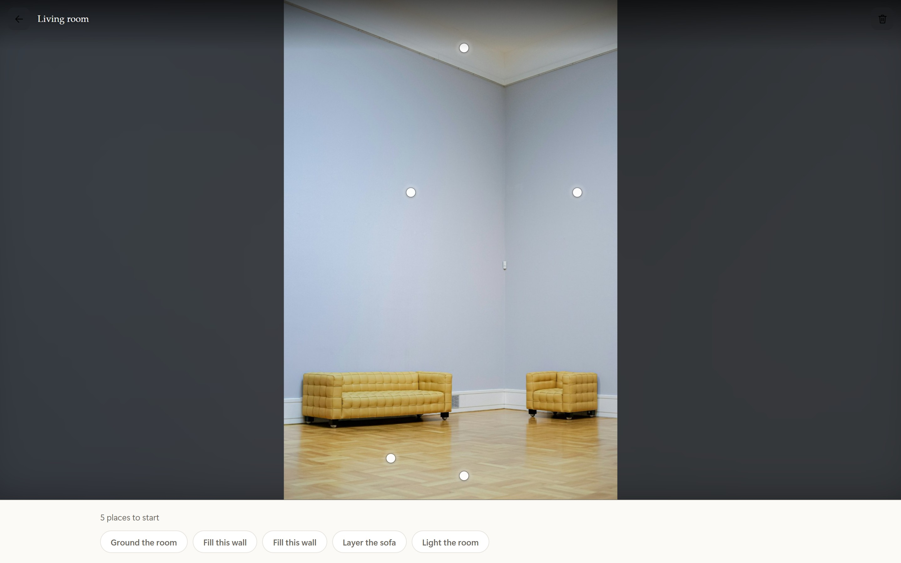
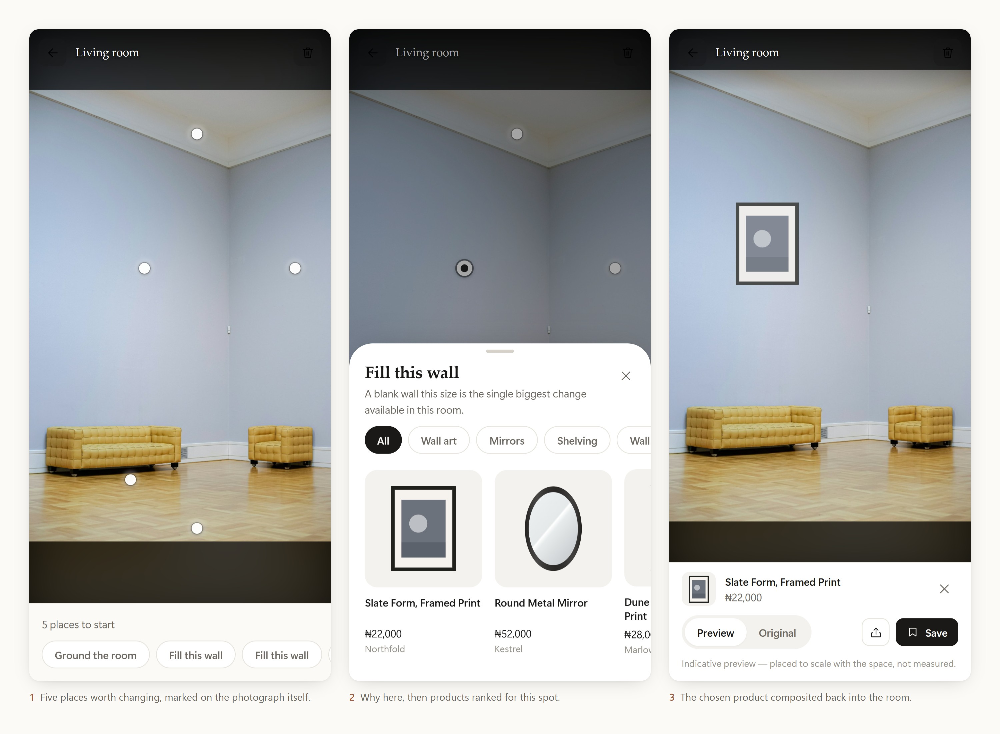
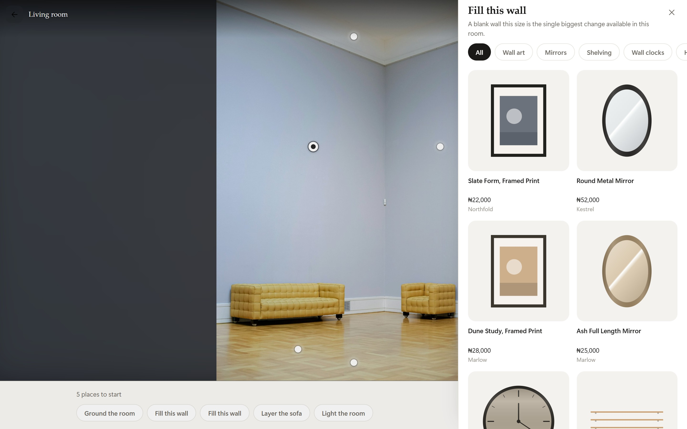
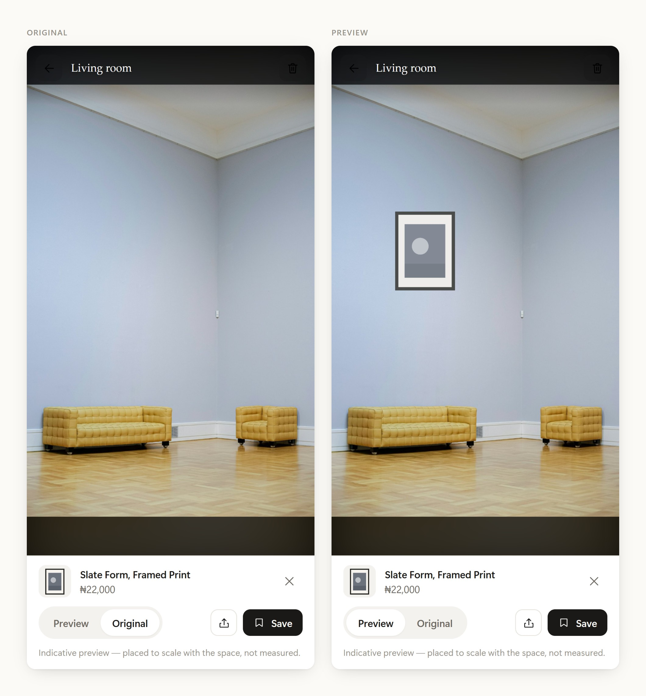
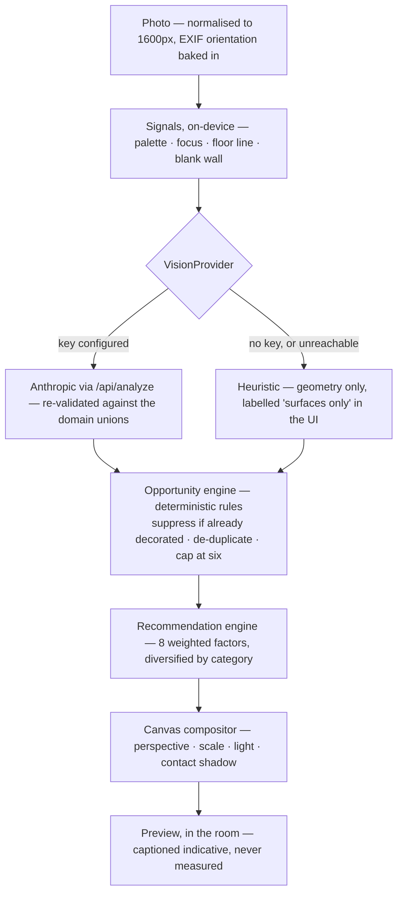
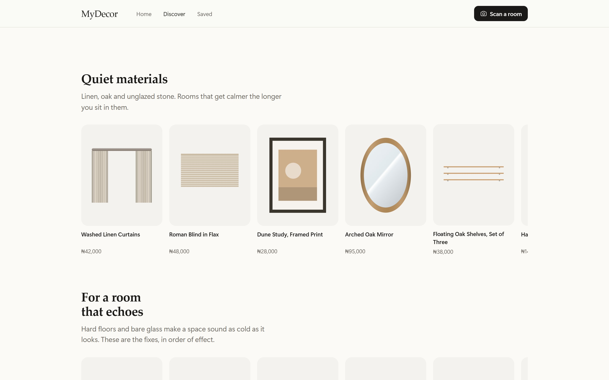

# MyDecor

**See what fits.** Photograph a room, see what could work in it — real products, placed in your own space, before you buy.

**[Open the live app →](https://mydecor-koyrstudio.vercel.app)** · Next.js 15 · TypeScript · No UI library



---

## What it is

People know a room isn't working, but not what to change — and they can't picture a product in their own space before it arrives. MyDecor addresses both in one loop: it reads a photograph of a room, marks the places worth changing and says why, then composites a chosen product back into that same photograph.

It is built for someone decorating their own home, in a market where almost no retailer publishes a product API. The home market is Nigeria — prices are in naira, set by hand.



> The room above is a stock photograph, analysed by the live app exactly as a user's own photo would be. Nothing in these screenshots is mocked up.

## My role

I designed and built this on my own — product thinking, interaction and visual design, the design system, and the full implementation across frontend, the server routes and the third-party integrations. There is no UI component library in `package.json`; every component here is authored.

What that means in practice: the decisions below are mine, and so is the code that carries them.

---

## Four decisions that shaped the product

### 1. Perception is separate from product judgement

**Problem.** If a model both *sees* the room and *decides* what it needs, then upgrading the model silently changes the product's taste, and nothing about its recommendations can be tested.

**Decision.** A vision provider answers exactly one question — what is in this photograph, and where. Everything about what a room *needs* is ordinary, deterministic code.

**Where it lives.** [`lib/vision/provider.ts`](src/lib/vision/provider.ts) defines the boundary; [`lib/vision/opportunities.ts`](src/lib/vision/opportunities.ts) holds the rules.

**What it changed.** Swapping the vision model cannot change a single recommendation. The rules are assertable — *"a wall wider than 16% of the frame yields one wall-art opportunity"* is a testable claim in a way that *"the model usually suggests art"* is not. It also made the next decision possible.

### 2. The system is allowed to say no

**Problem.** The easy version of this product marks every surface it can find. That isn't insight, it's a heat map of the catalogue.

**Decision.** Rules suppress themselves when a surface already carries what they would suggest — curtains on the window, a rug on the floor, art on the wall. Surviving candidates are de-duplicated spatially and capped at six.

**What it changed.** A fully decorated room correctly returns very few suggestions. Choosing the photograph above made this visible: running eight candidate rooms through the live analyser, the already-styled ones came back with their surfaces reported as occupied — rug on the floor, curtains at the window, art on the wall — each of which suppresses its own rule. The room I chose came back with nothing occupied, and yielded five opportunities.

### 3. You choose between kinds of solution before you choose a product

**Problem.** Once the catalogue had twenty items per category, pure score order collapsed variety — *"fill this wall"* returned eight near-identical prints, with no mirror and no shelf.

**Decision.** Rank within a category by score, then deal round-robin across the opportunity's categories.

**Where it lives.** `diversify()` in [`lib/products/recommendations.ts`](src/lib/products/recommendations.ts).

**What it changed.** The shortlist below opens with a print beside a mirror, and a clock and a shelf under them — because at this moment the user is deciding *what kind of thing* fixes this wall, not which of eight prints they prefer.



### 4. What it does not know, it says

**Problem.** The app has no measurement of the room, its catalogue is not always purchasable, and without a vision key it cannot recognise furniture. Each is an opportunity to overclaim.

**Decision.** Uncertainty is carried in the domain model and surfaced in the interface, not buried. `Visualization.fidelity` is `'indicative' | 'measured'`; `RoomAnalysis.isHeuristic` drives a "surfaces only" label; `Product.isReference` decides whether a buy link exists at all.

**What it changed.** Every preview is captioned *"placed to scale with the space, not measured."* A geometry-only analysis says so rather than implying the room was recognised. A reference product shows no Buy button, because a button that goes nowhere is worse than no button.

> This one has teeth. `isReference` originally lived on the *repository*, but the repository falls back to the bundled catalogue when a live retailer fails — so with a misconfigured retailer key, fallback items were presented as purchasable with dead links. The fix was to move provenance onto the product itself, where it survives the fallback ([`21329e1`](https://github.com/heykoyr/mydecor/commit/21329e1)).



---

## How it works



**Signals** ([`vision/signals.ts`](src/lib/vision/signals.ts)) run in the browser before any model: a coarse palette histogram, Laplacian-variance focus, the strongest horizontal discontinuity in the lower frame (the floor line), connected bright regions (windows), and per-column edge density above the horizon (blank wall). Photo-quality problems are caught here, while the user is still standing in the room.

**Perception** has two implementations. The remote one calls Anthropic through a server route using a tool definition for structured output, and re-validates every field against the domain unions before it reaches the app — enums checked, numbers clamped, out-of-frame boxes rejected. Model output is treated as untrusted input, because that is what it is. The heuristic one infers walls, windows, floors and corners from the signals above and deliberately does not guess at furniture, which is not geometrically inferable. Selection is automatic and degrades: a configured-but-unreachable model still yields a usable room.

**Compositing** ([`visualize/draw.ts`](src/lib/visualize/draw.ts)) places the product into the photograph. Canvas 2D has no projective transform, so the surface quad is filled by slicing the artwork into 48 vertical strips, each drawn under its own affine transform and *clipped* rather than source-cropped — drawing sub-rectangles antialiases 48 strip edges into visible vertical banding. Surface-filling and wall-mounted items are sized against the region's width; anything standing on a floor is sized against its **height**, because height against the surface behind it is what communicates real scale. The room's own colour and brightness are sampled under the placement and the artwork is graded to match before it is drawn.

Geometry is normalised (0–1) against the source image everywhere — so one analysis drives a thumbnail and a 12-megapixel original identically. Fitting, however, happens in **pixel** space: normalised units are anisotropic on any non-square photo, and fitting there stretches a product by the photograph's own aspect ratio. A round wall clock composited as an ellipse until that was fixed.

---

## Design system

Authored, not adopted. Tailwind's palette, spacing and type scale are **replaced** rather than extended — an unconstrained palette is how design systems rot.

- **Type** — nine named steps, each with fixed weight, line height and letter spacing. Components reference names, never raw sizes. An editorial serif carries display and headings; a system sans carries UI.
- **Colour** — warm neutral surfaces so photography is the only true colour in the interface, one clay accent, semantic success/warning/danger. Light is canonical; dark redefines only what must change.
- **Spacing** — a 4px ramp. **Radius** — five steps. **Elevation** — three shadows, all meaning depth.
- **One modal surface**, which adapts: a bottom sheet on phones, a right-hand panel on desktop where covering the room would defeat the point of judging a product against it.

Accessibility is implemented rather than claimed: skip link, focus trap with restoration, Escape handling, scroll lock with scrollbar compensation, 44px minimum touch targets, `aria-live` progress, and `prefers-reduced-motion` honoured by zeroing durations rather than shortening them.

---

## Built with

| Concern | Choice | Why |
| --- | --- | --- |
| Framework | Next.js 15 (App Router), React 19 | Server routes keep provider keys off the client; RSC keeps the shell light on mobile |
| Language | TypeScript, `strict` + `noUncheckedIndexedAccess` | Geometry and catalogue code is where silent `undefined` bugs hide |
| Styling | Tailwind 3.4 over CSS custom properties | One token layer drives light/dark and any future re-theme |
| Motion | Framer Motion | Sheet, hotspot and preview transitions; respects `prefers-reduced-motion` |
| State | Zustand | Small, synchronous stores; no provider tree |
| Persistence | IndexedDB behind repository interfaces | Local-first: photographs of people's homes never leave the browser |

Seven runtime dependencies. Routes: `/`, `/scan`, `/room/[id]`, `/discover`, `/saved`, plus `/api/analyze`, `/api/catalog` and `/api/image` — an allow-listed proxy, needed because a cross-origin image taints the canvas the compositor reads back.

---

## Market and retailers

Nigeria. `brand.locale` and `brand.currency` are `en-NG` and `NGN`, and the reference catalogue is priced in naira at figures set by hand rather than converted — a rate conversion is arithmetically correct and commercially meaningless.

| Retailer | How it is reached | Status |
| --- | --- | --- |
| Etsy | Open API v3 | Adapter implemented |
| Amazon · Jumia · Konga | Affiliate product feed | Via `PRODUCT_FEEDS` — configuration, not code |
| Temu | Referral links only; no product API or feed | Not reachable as product data |

Only Etsy publishes a product-search API a third party can call. The rest expose products to approved affiliates as a feed, which `FeedSource` consumes through a field mapping — so adding one is a config change. That asymmetry is the actual commercial constraint on this product, and the architecture is shaped around it.



---

## What's built, and what isn't

The core loop runs end to end today: photograph a room, get hotspots on real surfaces, open one, browse ranked products, and see a product composited into your own photo with perspective, scale, colour grading and a contact shadow.

**Shipped** — capture and upload · room analysis and hotspots · catalogue and recommendations · in-room preview · saved rooms and products · editorial discovery.

**Not yet** — a preferences UI (the ranking engine already reads budget and style; nothing sets them) · accounts and sync, so rooms outlive one browser · automated tests, which belong first on the opportunity engine, recommendation scoring and quad geometry, since those are pure functions where a regression would be least visible.

**Known limits, kept current**

- **Previews are indicative, not measured.** No dimensions for the room, so products are placed at plausible rather than true scale. Every preview says so.
- **No occlusion.** A composited product draws over everything in its region.
- **The bundled catalogue is not purchasable**, and its artwork is generated parametric SVG rather than retailer photography — good enough to judge scale, colour and placement; not a photograph of the thing you would receive.
- **Without a vision key, analysis is geometric only** — surfaces, no furniture. The UI labels this rather than implying otherwise.
- **Local-first, single device.** No account, so rooms don't follow a user to another browser.
- **No user research yet.** The product decisions above are reasoned from the problem, not validated against users.

---

<details>
<summary><strong>Run it locally</strong></summary>

Requires Node 20.19+.

```bash
npm install && npm run dev
```

The app runs with no configuration at all — on-device analysis and the bundled reference catalogue — and says so in the UI rather than implying otherwise. Copy `.env.example` to `.env.local` to turn capabilities on.

| Variable | Effect when unset | Effect when set |
| --- | --- | --- |
| `ANTHROPIC_API_KEY` | Geometric analysis only — surfaces, no furniture | Full object detection, unlocking the sofa, bed, table, desk and TV opportunities |
| `VISION_PROVIDER` | `auto` — model when a key exists, else on-device | `heuristic` forces the on-device analyser |
| `ETSY_API_KEY` | Etsy absent from the registry | Etsy listings join the catalogue |
| `PRODUCT_FEEDS` | No feed-based retailers | Each mapped JSON feed becomes a retailer |
| `IMAGE_HOST_ALLOWLIST` | Only Etsy's CDN is proxied | Adds the image hosts your feeds serve from |
| `AFFILIATE_TAG` / `NEXT_PUBLIC_AFFILIATE_TAG` | No attribution on outbound links | Outbound links carry attribution |
| `NEXT_PUBLIC_APP_URL` | Derived from Vercel, else localhost | Overrides the canonical origin |

Deployed on Vercel; pushes to `main` deploy to production. `next build` and `next dev` cannot run simultaneously in a OneDrive-synced checkout — both write `.next`, which surfaces as `EPERM`.

</details>

---

## Licence

© Adekoya Oluwafemi. All rights reserved. Available here to be read and evaluated; not licensed for reuse or redistribution.
